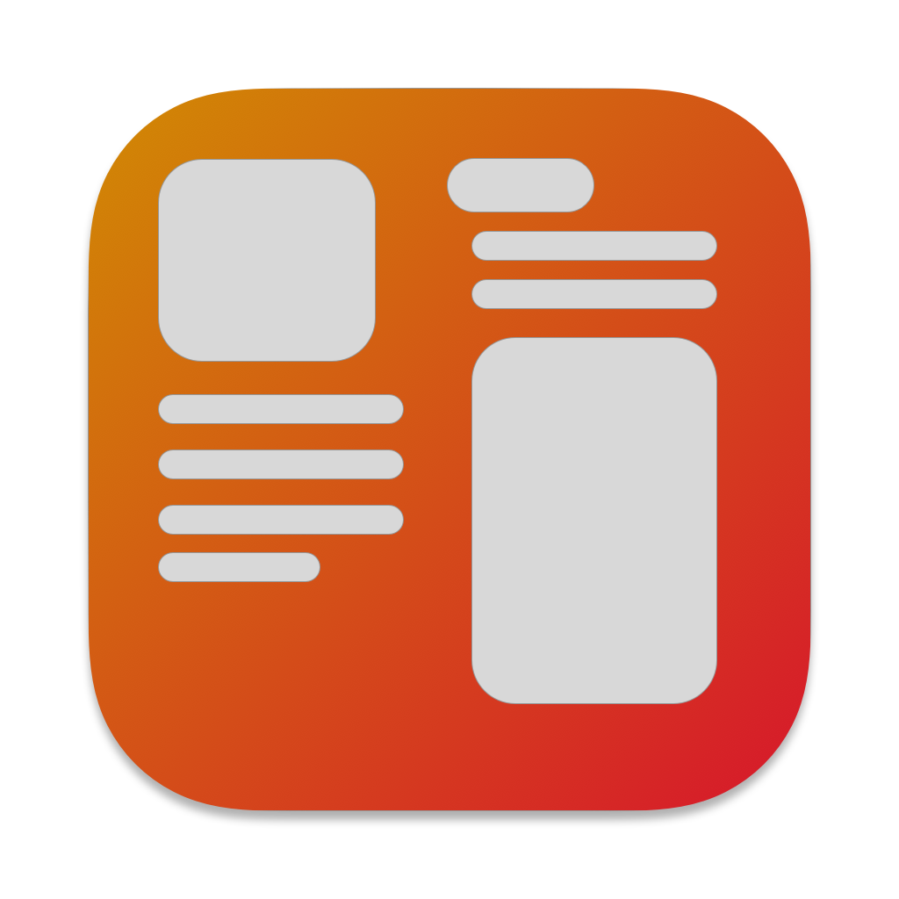

<!-- PROJECT LOGO -->
<br />
<div align="center">
  <a href="https://github.com/ShawnAlisson/theLanding">
    
  </a>

  <h3 align="center">theLanding</h3>

  <p align="center">
    Simple Landing Page for introducing iOS & macOS apps.
  </p>
</div>

### Built With

- Next.js
- Tailwind CSS

<!-- GETTING STARTED -->

## Getting Started

1. Clone the repo

   ```sh
   git clone https://github.com/ShawnAlisson/theLanding.git
   ```

2. Install NPM packages and Build

   ```sh
   npm i
   ```

3. Run the server in development mode:

   ```sh
   npm run dev
   ```

4. Open [http://localhost:3000] with your browser to see the result.

<p align="right">(<a href="#readme-top">back to top</a>)</p>
